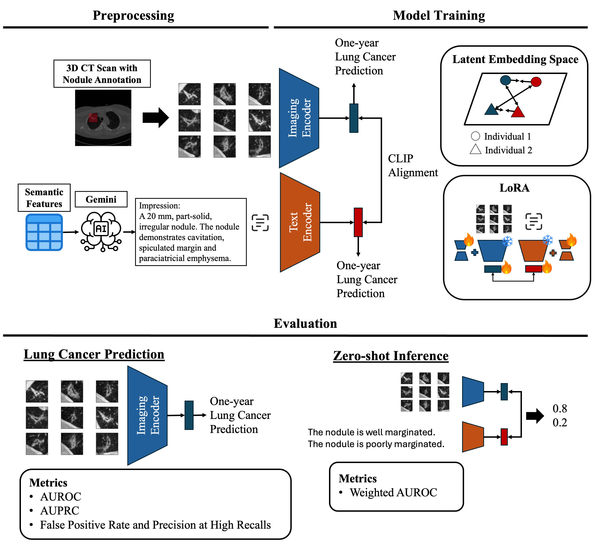

# Vision-Language Model-Based Semantic-Guided Imaging Biomarker for Lung Nodule Malignancy Prediction

[](https://arxiv.org/abs/2504.21344)


**Luoting Zhuang, Seyed Mohammad Hossein Tabatabaei, Ramin Salehi-Rad, Linh M. Tran, Denise R. Aberle, Ashley E. Prosper, William Hsu**

<sup>1</sup>Medical & Imaging Informatics, Department of Radiological Sciences, David Geffen School of Medicine at UCLA, Los Angeles, CA;  

<sup>2</sup>Department of Medicine, Division of Pulmonology and Critical Care, David Geffen School of Medicine at UCLA, Los Angeles, CA


<p align="center">
     <br />
    <em> 
    Figure 1. An overview of the proposed framework. 
    </em>
</p>

**Objective:** Machine learning models have utilized semantic features, deep features, or both to assess lung nodule malignancy. However, their reliance on manual annotation during inference, limited interpretability, and sensitivity to imaging variations hinder their application in real-world clinical settings. Thus, this research aims to integrate semantic features derived from radiologists’ assessments of nodules, guiding the model to learn clinically relevant, robust, and explainable imaging features for predicting lung cancer. 

**Methods:** We obtained 938 low-dose CT scans from the National Lung Screening Trial (NLST) with 1,246 nodules and semantic features. Additionally, the Lung Image Database Consortium dataset contains 1,018 CT scans, with 2,625 lesions annotated for nodule characteristics. Three external datasets were obtained from UCLA Health, the LUNGx Challenge, and the Duke Lung Cancer Screening. For imaging input, we obtained 2D nodule slices from nine directions from 50×50×50mm nodule crop. We converted structured semantic features into sentences using Gemini. We \revision{fine-tuned} a pretrained Contrastive Language-Image Pretraining (CLIP) model with a parameter-efficient fine-tuning approach to align imaging and semantic features and predict the one-year lung cancer diagnosis.  

**Results:** We evaluated the performance of the one-year diagnosis of lung cancer. Our model demonstrated an AUROC of 0.901 and AUPRC of 0.776 in the NLST test set, also outperforming state-of-the-art(SOTA) models on external datasets. Using CLIP, we also obtained predictions on semantic features through zero-shot inference, such as nodule margin (AUROC: 0.812), nodule consistency (0.812), and pleural attachment (0.840).  

**Conclusion:** Our approach surpasses the SOTA models in predicting lung cancer across various datasets from diverse clinical settings, providing explainable outputs, aiding clinicians in comprehending the underlying meaning of model predictions. This approach also prevents the model from learning shortcuts and generalizes across clinical settings.

## :rocket:Getting Started
### 1. :hammer_and_wrench:Setup Environment

#### Option 1: Docker container
```bash
docker run --shm-size=8g --gpus all -it --rm -v .:/workspace -v /etc/localtime:/etc/localtime:ro nvcr.io/nvidia/pytorch:24.03-py3
```
- If you use `-v .:/workspace` as shown above, Docker will map the **current directory** to `/workspace` inside the container.
- To map a different folder to a specific path in a docker container, you can replace `-v .:/workspace` with `-v /path/to/local/folder:/path/in/container`.

#### Option 2: Conda environment
```bash
conda create -n clip_nodule python=3.10 -y 
conda activate clip_nodule 
conda install pytorch torchvision torchaudio pytorch-cuda=12.1 -c pytorch -c nvidia
```

### 2. :package:Clone the Repository and Install Packages
1. Go to the folder you want to store the code and clone the repo
```bash
git clone https://github.com/luotingzhuang/CLIP_nodule.git
cd CLIP_nodule
```

2. Install all of the required Python packages using the following command line.
```bash
pip install -r requirements.txt
```

### 3. :file_folder:Data Requirement
To prepare a CSV file, list the path to the **NIfTI** file under the `image_path` column, along with the corresponding `pid` and `nodule_id`. `coordX`, `coordY`, and `coordZ` are the nodule centroid in a global coordinate system. These can be extracted from the nodule mask using the [code](https://github.com/AIM-Harvard/foundation-cancer-image-biomarker/blob/master/tutorials/get_seed_from_mask.ipynb). If the nodule mask is not available, we recommend using a nodule detection algorithm, such as [monai nodule detection](https://catalog.ngc.nvidia.com/orgs/nvidia/teams/monaitoolkit/models/monai_lung_nodule_ct_detection) to obtain the nodule location from CT scans.

For inference, the CSV file should contain six columns:  
| pid    | nodule_id | image_path                                      | coordX     | coordY     | coordZ      | 
|--------|-----------|--------------------------------------------------|------------|------------|-------------|
| 121389 | 0         | ./sample_data/121389/2001-01-02/image.nii.gz     | -38.038567 | -73.942905 | -111.030769 |

Refer to `./dataset_csv/sample_csv.csv` as an example. Note that the `malignant` column is optional in inference.

Due to data sharing restrictions, we cannot release the in-house annotated semantic features for the NLST dataset. However, we provide synthetic data to illustrate usage. The CSV file is in
`./dataset_csv/sample_csv_semantic_feats.csv`. 

CT scans in our sample data can be downloaded from the [link](https://drive.google.com/drive/folders/1WcOUPaSRRIENU-U1SQpC41WZz2nPP4iH?usp=drive_link).
```bash
# You can also download it using gdown
pip install gdown
gdown --folder 'https://drive.google.com/drive/folders/1MhcOCLpG1OrdGyQw9OiwNQELZKfIBGlr?usp=drive_link'
```
:warning:Note: Try add `--fuzzy --no-cookies --no-check-certificate` if there is an error running the gdown command. Some institutional Wi-Fi may block Google services. If it still does not work, try downloading the folder using the link via a browser.

## Preprocessing
### 1. :broom: Image Preprocessing
First, we need to crop a 100×100×100 mm bounding box around the nodule and save the resulting cropped volume as a `.pt` file for later use.

```bash
python crop_nodule.py --dataset_path ./dataset_csv/sample_csv.csv --save_path ./cropped_img --crop_size 100
```

#### Important Arguments
| Argument      | Type  | Default | Description |
|--------------|------|---------|-------------|
| `--crop_size` | int  | `100` | Size of the crop for the nodules. |

Note: The crop size should typically be set slightly larger than the target size to accommodate data augmentation during training. A final cropping step will be applied afterward.

The nodule crop will be saved with the format `{pid}_{nodule_id}.pt`.

### 2. :page_facing_up:Semantic Features Preprocessing (Only for Training)
We need to convert semantic features, which were originally in tabular format, into texts. The code for transformation is shown in ``./notebook/tabular2text.ipynb``.

Download `report_generation` from the [link](https://drive.google.com/drive/folders/1LO3t7r6xZ6WakMFTt17snKRggsNCvL21?usp=sharing) and put it under `./CLIP_nodule`.
```bash
# You can also download it using gdown
pip install gdown
gdown --folder 'https://drive.google.com/drive/folders/1LO3t7r6xZ6WakMFTt17snKRggsNCvL21?usp=sharing'
```

### 3. :jigsaw:Create Cross-Validation Splits (Only for Training)
In our training, we used k-fold CV. The splits folder should have the following structure.
```
splits/
├── fold_0/
│   ├── train_pid.csv
│   └── val_pid.csv
├── ...
```
Each CSV file must contain a single column named pid, which lists all patient IDs included in that split. You can find example CSV files in the ``splits`` folder of the repository. We also provide sample code to generate the splits in the ``./notebook/create_splits.ipynb``.

## Model Training and Inference
### 1. :arrow_forward:Run Training

```bash
CUDA_VISIBLE_DEVICES=0 python train.py \
  --dataset_path ./dataset_csv/sample_csv_with_semantic_feats.csv \
  --result_dir ./results \
  --img_dir ./cropped_img \
  --text_dir ./report_generation \
  --split_dir ./splits \
  --n_splits 5
```
#### Important Arguments
| Argument             | Type    | Default  | Description                                     |
|----------------------|---------|----------|-------------------------------------------------|
| `--crop_size`        | int     | 50       | Size of the crop for the images.                |
| `--batch_size`       | int     | 4        | Batch size for training.                        |
| `--lr`               | float   | 1e-4     | Learning rate for the optimizer.                |
| `--weight_decay`     | float   | 1e-1     | Weight decay for the optimizer.                 |
| `--epochs`           | int     | 100      | Number of epochs for training.                  |
| `--es_warmup`        | int     | 0        | Warmup epochs for early stopping.               |
| `--es_patience`      | int     | 5        | Patience for early stopping.                    |
| `--dropout`          | float   | 0.1      | Dropout rate for the model.                     |
| `--ga`               | int     | 1        | Gradient accumulation steps.                    |
| `--tuning`           | str     | 'ft'     | Tuning method (`ft`, `pt`, or `lora`).          |
| `--clip_loss_weight` | float   | 1.0      | Weight for the CLIP loss.                       |
| `--img_loss_weight`  | float   | 1.0      | Weight for the image loss.                      |
| `--text_loss_weight` | float   | 1.0      | Weight for the text loss.                       |
| `--weighted`         | str     | 'diagnosis' | Weighted sampling method (`diagnosis`, `semantic`). |
| `--tau`              | float   | 0.07     | Temperature for the CLIP loss.                  |
| `--out_dim`          | int     | 256      | Output dimension of last layer before classifier.  |
| `--position`         | str     | 'all'    | Where to put the LoRA modules.                  |
| `--encoder`          | str     | 'both'   | Encoder to apply LoRA to (`text`, `vision`, `both`). |
| `--params`           | list[str]| ['q','k','v'] | Attention matrices to apply LoRA to.        |
| `--r`                | int     | 2        | Rank of the low-rank matrices.                  |
| `--alpha`            | int     | 1        | Scaling factor (see LoRA paper).                |
| `--dropout_rate`     | float   | 0.25     | Dropout rate applied before the LoRA module.    |

Additional arguments, such as those related to data augmentation, can be found in the script.

The checkpoints and arguments are saved in the ``result_dir``, under folders named in the format ``experiment_YYYYMMDD_HHMMSS``.
```
experiment_YYYYMMDD_HHMMSS/
├── args.txt               # All training arguments saved as plain text
├── fold_0/
│   ├── best_both.pt       # Checkpoint with best combined CLIP + prediction loss
│   ├── best_clip.pt       # Checkpoint with best CLIP loss
│   ├── best_pred.pt       # Checkpoint with best prediction loss
│   ├── ckpt.pt            # Latest checkpoint
│   └── events.out.tfevents...  # TensorBoard logs
├── ...
```

### 2. :arrow_forward:Run Inference

```bash
CUDA_VISIBLE_DEVICES=0 python evaluate.py \
  --model_path ./results/experiment_YYYYMMDD_HHMMSS \
  --dataset_path ./dataset_csv/sample_csv.csv \
  --img_dir ./cropped_img \
  --num_workers 4 \
  --save_path ./results_csv \
  --ckpt_file best_both.pt
```
The output CSV file will be saved at `{save_path}/experiment_YYYYMMDD_HHMMSS_best_both_result.csv`. It includes the pid and the corresponding predicted probabilities. Each `raw_X` column represents the probability output from fold X, while the `ensemble` column contains the average probability across all folds.

### 3. :arrow_forward:Run Inference Using Our Pretrained Model
Download `ckpt` from the [link](https://drive.google.com/drive/folders/1WcOUPaSRRIENU-U1SQpC41WZz2nPP4iH?usp=drive_link) and put it under `./CLIP_nodule`.

```bash
gdown --folder 'https://drive.google.com/drive/folders/1V1bUAt3Hl2WNh5eZmQCZHDqQmEd1FT7W?usp=sharing'
```
```bash
CUDA_VISIBLE_DEVICES=0 python evaluate.py \
  --model_path ./ckpt \
  --dataset_path ./dataset_csv/sample_csv.csv \
  --img_dir ./cropped_img \
  --num_workers 4 \
  --save_path ./results_csv \
  --ckpt_file best_both.pt \
  --calibrate
```

## Acknowledgements
This project is based on the code from the following repository:
- [CLIP](https://github.com/openai/CLIP)
- [CLIP-LoRA](https://github.com/MaxZanella/CLIP-LoRA.git)
- [foundation-cancer-image-biomarker](https://github.com/AIM-Harvard/foundation-cancer-image-biomarker/tree/master)


## CITATION
```bibtex
@article{zhuang2025vision,
  title={Vision-Language Model-Based Semantic-Guided Imaging Biomarker for Early Lung Cancer Detection},
  author={Zhuang, Luoting and Tabatabaei, Seyed Mohammad Hossein and Salehi-Rad, Ramin and Tran, Linh M and Aberle, Denise R and Prosper, Ashley E and Hsu, William},
  journal={arXiv preprint arXiv:2504.21344},
  year={2025}
}
```

## CONTACT
If you have any questions, please don't hesitate to contact us at luotingzhuang@g.ucla.edu.
